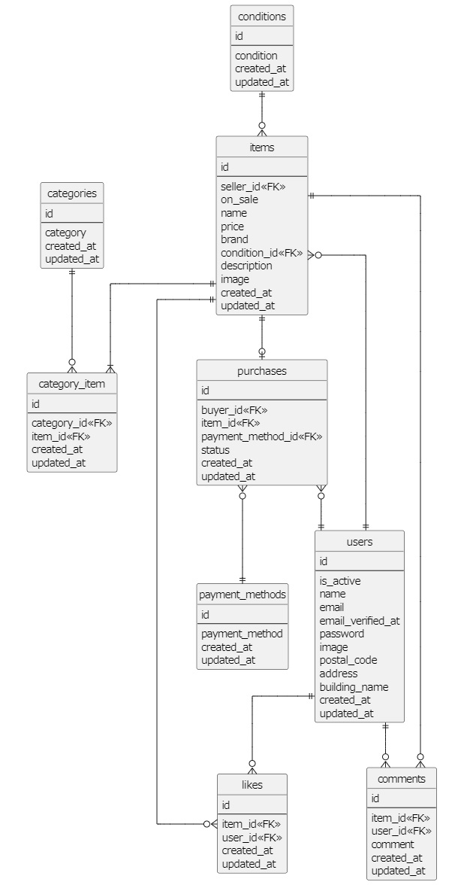

## アプリケーション名
coachtech フリマアプリ （carmeri）

## 環境構築
1. GitHubよりデータを取得する
    ```
    $ git clone git@github.com:Atsu-su/carmeri.git  
    $ cd carmeri/src  
    $ cp -p .env.bk .env  
    ```

2. .envファイルの修正  

    APP_NAME=carmeri  
    ...  
    DB_HOST=mysql  
    DB_DATABASE=laravel_db  
    DB_USERNAME=laravel_user  
    DB_PASSWORD=laravel_pass  
    ...  
    MAIL_FROM_ADDRESS=`carmeri@example.com`  

3. コンテナの作成  
    ```
    $ docker-compose up -d  
    ```

4. laravelの各種設定
    ```
    $ docker-compose exec php bash  
    # chown www-data:www-data -R storage  
    # composer install  
    # art key:generate  
    # art migrate  
    # art db:seed  
    ```

5. ブラウザにてアクセス

    ブラウザを使い、http://localhost/ にアクセスする。

6. テスト環境の設定
    ```
    $ docker-compose exec mysql bash  
    # mysql -u root -p  
    Enter password: （rootのパスワード）
    mysql> create database test_laravel_db;  
    mysql> grant all privileges on test_laravel_db . * to 'laravel_user'@'%';  
    mysql> exit;  
    # exit  
    $ docker-compose exec php bash  
    # art migrate --env=testing  
    ```

7. テストの実施
    ```
    $ cd （cloneを実施したディレクトリ）/carmeri/src  
    $ docker-compose exec php bash  
    # ./test.sh  
    ```

（注意点）
- MYSQLのタイムゾーン設定はデフォルトである。（Asia/Tokyoではない）
- 項番4のmigrate時にMySQLの権限エラーが出力した場合は以下の手順を実行すること。

    ```
    $ docker-compose exec mysql bash
    # mysql -u root
    mysql> set password for 'root'@'localhost' = '（任意のパスワード）'
    mysql> select user, host from mysql.user;

    ＜laravel_userが存在することを確認する＞

    ＜存在しない場合、以下のコマンドにてユーザを作成し、権限を付与する＞

    ※存在しない場合
    mysql> select user, host from mysql.user;
    +------------------+-----------+
    | user             | host      |
    +------------------+-----------+
    | mysql.infoschema | localhost |
    | mysql.session    | localhost |
    | mysql.sys        | localhost |
    | root             | localhost |
    +------------------+-----------+

    mysql> create user 'laravel_user'@'%' identified by 'laravel_pass';
    mysql> grant all privileges on laravel_db.* to 'laravel_user'@'%';
    mysql> flush privileges;
    mysql> select user, host from mysql.user;
    +------------------+-----------+
    | user             | host      |
    +------------------+-----------+
    | laravel_user     | %         |
    | mysql.infoschema | localhost |
    | mysql.session    | localhost |
    | mysql.sys        | localhost |
    | root             | localhost |
    +------------------+-----------+

    ＜laravel_dbがあることを確認する＞
    mysql> show databases;

    ＜存在しない場合、以下の手順で作成する＞
    mysql> create database laravel_db;
    mysql> grant all privileges on laravel_db . * to 'laravel_user'@'%';
    mysql> flush privileges;
    ```
    再度migrationから実行する。  

    またはcarmeri/docker/mysql/dataを削除し再度以下のコマンドを実行すると正常になることもある。  
    ```
    $ docker-compose up -d  
    ```

## 使用技術(実行環境)
Laravel Framework 8.83.8  
Composer version 2.7.9  
PHP version 7.4.9  
nginx 1.21.1  
mysql 8.0.26  

## ER図


## 特記事項
### 画面定義
#### PG02
タブの切り替えはJavascriptで実装したため、パスは存在しない。  
#### PG11 / PG12
タブの切り替えはJavascriptで実装したため、パスは存在しない。  

### メール確認機能
メールアドレス確認機能を搭載したため、ユーザ登録後、localhost:8025で  
mailhogにアクセスし、メールの確認を行う必要がある。確認するとプロフィ  
ール登録画面へ遷移する。

### テストの実施について
carmeri/srcにtest.shを作成している。artisan testコマンドを実行すると  
DBの不整合が発生し、テストが正常に完了しない。そのため、テスト  
実施には以下のコマンドを実行すること。  

\$ docker-compose exec php bash  
\# art .test.sh  

テストが一つずつ実行され、プロフィール用のテスト画像がテスト実行  
の度にtests/test_images/profile_imagesからコピーされ復元される。これは  
テスト時にプロフィール画像が削除され、後続のテストに支障をきたすため  
復元している。個別にテストを実行することも可能である。

### テストケースNo.11について
実施不可であるため、作成していない。支払方法の表示切替はJavascriptで  
実装している。

### 基本設計書 バリデーション
各種修正箇所を赤字で記載している。

## URL
http://localhost/
